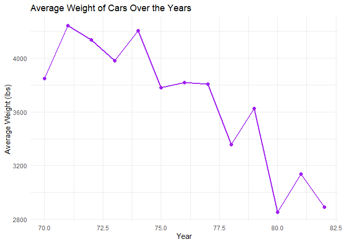
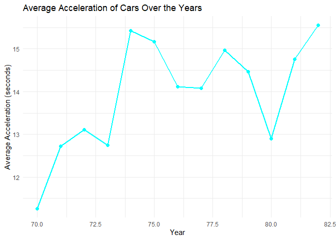
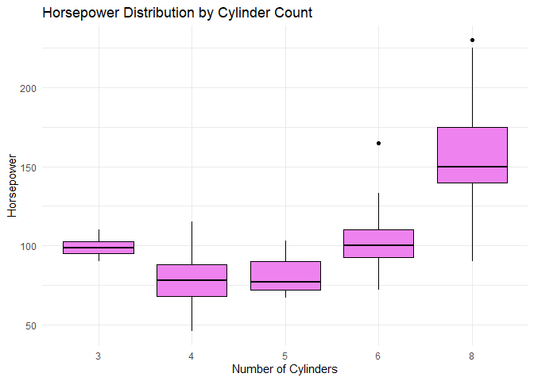
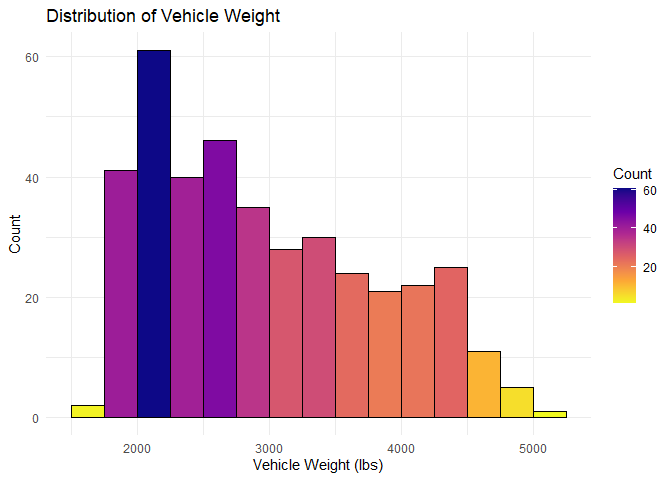

# Data Visualization Project 01

## DATA SET

In this document we will be looking at the __auto.csv data set__. This set contains information about different automotive vehicles, such as make and model, number of cylinders, MPG, etc. This mini project will aim to summarize this data, and provide several visual representations using ggplot2.


``` r
library(tidyverse)

auto <- read_csv("../data/Auto.csv")

#Displaying the raw data
glimpse(auto)
```

```
## Rows: 392
## Columns: 9
## $ mpg          <dbl> 18, 15, 18, 16, 17, 15, 14, 14, 14, 15, 15, 14, 15, 14, 2…
## $ cylinders    <dbl> 8, 8, 8, 8, 8, 8, 8, 8, 8, 8, 8, 8, 8, 8, 4, 6, 6, 6, 4, …
## $ displacement <dbl> 307, 350, 318, 304, 302, 429, 454, 440, 455, 390, 383, 34…
## $ horsepower   <dbl> 130, 165, 150, 150, 140, 198, 220, 215, 225, 190, 170, 16…
## $ weight       <dbl> 3504, 3693, 3436, 3433, 3449, 4341, 4354, 4312, 4425, 385…
## $ acceleration <dbl> 12.0, 11.5, 11.0, 12.0, 10.5, 10.0, 9.0, 8.5, 10.0, 8.5, …
## $ year         <dbl> 70, 70, 70, 70, 70, 70, 70, 70, 70, 70, 70, 70, 70, 70, 7…
## $ origin       <dbl> 1, 1, 1, 1, 1, 1, 1, 1, 1, 1, 1, 1, 1, 1, 3, 1, 1, 1, 3, …
## $ name         <chr> "chevrolet chevelle malibu", "buick skylark 320", "plymou…
```

``` r
summary(auto)
```

```
##       mpg          cylinders      displacement     horsepower        weight    
##  Min.   : 9.00   Min.   :3.000   Min.   : 68.0   Min.   : 46.0   Min.   :1613  
##  1st Qu.:17.00   1st Qu.:4.000   1st Qu.:105.0   1st Qu.: 75.0   1st Qu.:2225  
##  Median :22.75   Median :4.000   Median :151.0   Median : 93.5   Median :2804  
##  Mean   :23.45   Mean   :5.472   Mean   :194.4   Mean   :104.5   Mean   :2978  
##  3rd Qu.:29.00   3rd Qu.:8.000   3rd Qu.:275.8   3rd Qu.:126.0   3rd Qu.:3615  
##  Max.   :46.60   Max.   :8.000   Max.   :455.0   Max.   :230.0   Max.   :5140  
##   acceleration        year           origin          name          
##  Min.   : 8.00   Min.   :70.00   Min.   :1.000   Length:392        
##  1st Qu.:13.78   1st Qu.:73.00   1st Qu.:1.000   Class :character  
##  Median :15.50   Median :76.00   Median :1.000   Mode  :character  
##  Mean   :15.54   Mean   :75.98   Mean   :1.577                     
##  3rd Qu.:17.02   3rd Qu.:79.00   3rd Qu.:2.000                     
##  Max.   :24.80   Max.   :82.00   Max.   :3.000
```

## Summarization

Here you can see the summary of the number of cars in the __Auto__ data set, grouped by cylinder count. This table shows how many cars have 3, 4, 5, 6, or 8 cylinders.


``` r
library(dplyr)

auto_summary <- auto %>%
  count(cylinders, name = "count") %>%
  rename(
    `Number of Cylinders` = cylinders,
    `Number of Cars` = count
  )

auto_summary
```

```
## # A tibble: 5 × 2
##   `Number of Cylinders` `Number of Cars`
##                   <dbl>            <int>
## 1                     3                4
## 2                     4              199
## 3                     5                3
## 4                     6               83
## 5                     8              103
```

In this summarization, we calculated the average, minimum, and maximum weights of vehicles in the _Auto_ data set. These values provide a quick overview of the vehicle weight distribution and establish a foundation for further analysis.


``` r
auto %>%
  summarise(
    `Average Weight` = mean(weight, na.rm = TRUE),
    `Minimum Weight` = min(weight, na.rm = TRUE),
    `Maximum Weight` = max(weight, na.rm = TRUE)
  )
```

```
## # A tibble: 1 × 3
##   `Average Weight` `Minimum Weight` `Maximum Weight`
##              <dbl>            <dbl>            <dbl>
## 1            2978.             1613             5140
```

In the final summary, you can find the data grouped by year to calculate the average weight, average acceleration, and number of cars for each year in the _Auto_ data set. These summary values provide insights into trends in vehicle characteristics over time.


``` r
auto %>%
  filter(horsepower > 100) %>%
  mutate(`Year` = year) %>%  
  group_by(`Year`) %>%
  summarise(
    `Average Weight` = mean(weight, na.rm = TRUE),
    `Average Acceleration` = mean(acceleration, na.rm = TRUE),
    `Number of Cars` = n()
  )
```

```
## # A tibble: 13 × 4
##     Year `Average Weight` `Average Acceleration` `Number of Cars`
##    <dbl>            <dbl>                  <dbl>            <int>
##  1    70            3850.                   11.3               19
##  2    71            4241.                   12.7                9
##  3    72            4136.                   13.1               14
##  4    73            3980.                   12.7               25
##  5    74            4205.                   15.4                7
##  6    75            3780.                   15.2               12
##  7    76            3820                    14.1               14
##  8    77            3807.                   14.1               12
##  9    78            3356.                   15.0               16
## 10    79            3624.                   14.5               13
## 11    80            2855                    12.9                2
## 12    81            3139                    14.8                5
## 13    82            2890                    15.6                2
```

##Data Visualization 

These line charts show how vehicle weight and average acceleration times have changed from 1970 to 1982. Over the years, cars have generally gotten lighter and their acceleration times have increased.


``` r
library(ggplot2)
library(dplyr)

auto_summary <- auto %>%
  filter(horsepower > 100) %>%
  mutate(Year = year) %>%  # Adjust 'year' if necessary
  group_by(Year) %>%
  summarise(
    `Average Weight` = mean(weight, na.rm = TRUE),
    `Average Acceleration` = mean(acceleration, na.rm = TRUE),
    `Number of Cars` = n()
  )

ggplot(auto_summary, aes(x = Year, y = `Average Weight`)) +
  geom_line(color = "purple", size = 1) +
  geom_point(color = "purple", size = 2) +
  labs(
    title = "Average Weight of Cars Over the Years",
    x = "Year",
    y = "Average Weight (lbs)"
  ) +
  theme_minimal()
```

```
## Warning: Using `size` aesthetic for lines was deprecated in ggplot2 3.4.0.
## ℹ Please use `linewidth` instead.
## This warning is displayed once every 8 hours.
## Call `lifecycle::last_lifecycle_warnings()` to see where this warning was
## generated.
```

<!-- -->

``` r
# Plot for Average Acceleration
ggplot(auto_summary, aes(x = Year, y = `Average Acceleration`)) +
  geom_line(color = "cyan", size = 1) +
  geom_point(color = "cyan", size = 2) +
  labs(
    title = "Average Acceleration of Cars Over the Years",
    x = "Year",
    y = "Average Acceleration (seconds)"
  ) +
  theme_minimal()
```

<!-- -->

This boxplot visualizes the spread of horsepower across vehicles with varying cylinder counts. As the number of cylinders increases, both the median and variability of horsepower rise, peaking with 8-cylinder vehicles that also exhibit the highest outliers. This visualization highlights a clear trend: more cylinders generally correspond to higher horsepower and greater performance potential.


``` r
library(ggplot2)
library(dplyr)

ggplot(auto, aes(x = factor(cylinders), y = horsepower)) +
  geom_boxplot(fill = "violet", color = "black") +
  labs(
    title = "Horsepower Distribution by Cylinder Count",
    x = "Number of Cylinders",
    y = "Horsepower"
  ) +
  theme_minimal()
```

<!-- -->

This histogram illustrates the distribution of vehicle weights in the data set, using the _viridis_ color palette to represent count density. The tallest bar corresponds to vehicles in the 2000 lbs range, indicating this weight category is the most common. The distribution skews right, with fewer heavier vehicles (over 4000 lbs), highlighting how most cars are lower weight.


``` r
library(ggplot2)
library(dplyr)


ggplot(auto, aes(x = weight, fill = ..count..)) +
  geom_histogram(binwidth = 250, color = "black", boundary = 0) +
  scale_fill_viridis_c(option = "plasma", direction = -1) +
  labs(
    title = "Distribution of Vehicle Weight",
    x = "Vehicle Weight (lbs)",
    y = "Count",
    fill = "Count"
  ) +
  theme_minimal()
```

```
## Warning: The dot-dot notation (`..count..`) was deprecated in ggplot2 3.4.0.
## ℹ Please use `after_stat(count)` instead.
## This warning is displayed once every 8 hours.
## Call `lifecycle::last_lifecycle_warnings()` to see where this warning was
## generated.
```

<!-- -->

``` r
ggsave("figures/histogram_weight.png",
       width = 6, height = 4, units = "in", dpi = 300)
```
