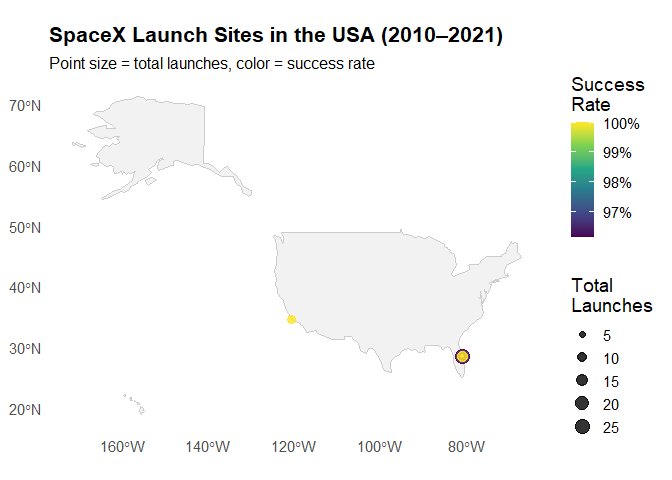
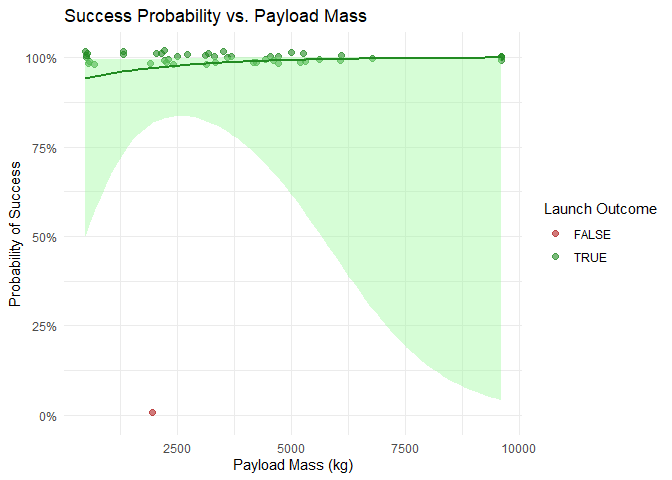
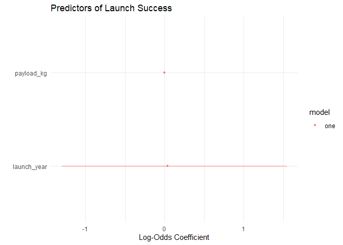

# Data Visualization Project 02

# Importing Data Set

Here I am importing the _spacex.csv_ data set into the markdown file, and initializing my libraries. This data set looks at launch data taken from 2010-0218. It contains information including date, launch site, payload size, mission outcome and more.

``` r
library(tidyverse)
library(sf)
library(plotly)
library(dplyr)

spacex <- read_csv("../data/spacex.csv") %>%
 mutate(
    Date       = as.Date(Date, "%B %d, %Y"),         # e.g. "June 4, 2010"
    Year       = year(Date),                         # extract integer year
    success    = (`Mission Outcome` == "Success"),   # TRUE/FALSE
    payload_kg = parse_number(`Payload Mass (kg)`)   # strip commas, make numeric
  )
glimpse(spacex)
```

```
## Rows: 51
## Columns: 14
## $ `Flight Number`     <chr> "1", "2", "3", "4", "5", "6", "7", "8", "9", "10",…
## $ Date                <date> 2010-06-04, 2010-12-08, 2012-05-22, 2012-10-08, 2…
## $ `Time (UTC)`        <time> 18:45:00, 15:43:00, 07:44:00, 00:35:00, 15:10:00,…
## $ `Booster Version`   <chr> "F9 v1.0", "F9 v1.0", "F9 v1.0", "F9 v1.0", "F9 v1…
## $ `Launch Site`       <chr> "CCAFS LC-40", "CCAFS LC-40", "CCAFS LC-40", "CCAF…
## $ Payload             <chr> "Dragon Spacecraft Qualification Unit", "Dragon de…
## $ `Payload Mass (kg)` <chr> NA, NA, "525 ", "500 ", "677 ", "500 ", "3,170 ", …
## $ Orbit               <chr> "LEO", "LEO", "LEO", "LEO", "LEO", "Polar orbit", …
## $ Customer            <chr> "SpaceX", "NASA (COTS) NRO", "NASA (COTS)", "NASA …
## $ `Mission Outcome`   <chr> "Success", "Success", "Success", "Success", "Succe…
## $ `Landing Outcome`   <chr> "Failure (parachutes)", "Failure (parachutes)", "N…
## $ Year                <dbl> 2010, 2010, 2012, 2012, 2013, 2013, 2013, 2014, 20…
## $ success             <lgl> TRUE, TRUE, TRUE, TRUE, TRUE, TRUE, TRUE, TRUE, TR…
## $ payload_kg          <dbl> NA, NA, 525, 500, 677, 500, 3170, 3325, 2296, 1316…
```

## Data Summary

In this section I filtered the SpaceX data to see:
- Number of launches per year
- Success rate per launch site
- Average payload mass by booster version


``` r
#Launches per year
launches <- spacex %>%
  group_by(
    Year = as.integer(format(as.Date(Date, "%B %d, %Y"),"%Y"))
  ) %>%
  summarize(
    `Number of Launches` = n(),
    `Success Rate`       = mean(success, na.rm = TRUE)
  ) %>%
  arrange(Year)

launches
```

```
## # A tibble: 8 × 3
##    Year `Number of Launches` `Success Rate`
##   <int>                <int>          <dbl>
## 1  2010                    2          1    
## 2  2012                    2          1    
## 3  2013                    3          1    
## 4  2014                    6          1    
## 5  2015                    7          0.857
## 6  2016                    8          1    
## 7  2017                   18          1    
## 8  2018                    5          0.8
```

``` r
#Success rate
success <- spacex %>%
  group_by(`Launch Site`) %>%
  summarize(
    `Total Launches` = n(),
    `Success Rate`   = mean(`Mission Outcome` == "Success", na.rm = TRUE),
    .groups = "drop"
  ) %>%
  arrange(desc(`Total Launches`))

success
```

```
## # A tibble: 5 × 3
##   `Launch Site`                                  `Total Launches` `Success Rate`
##   <chr>                                                     <int>          <dbl>
## 1 CCAFS LC-40                                                  26          0.962
## 2 KSC LC-39A                                                   13          1    
## 3 VAFB SLC-4E                                                   8          1    
## 4 CCAFS SLC-40                                                  3          1    
## 5 CCAFS SLC-40 (after static fire on KSC LC-39A)                1          0
```

``` r
#Avg Mass
payload <- spacex %>%
  group_by(Booster = `Booster Version`) %>%
  summarise(
    `Average Payload (kg)` = mean(parse_number(`Payload Mass (kg)`), na.rm = TRUE),
    `Number of Launches`   = n(),
    .groups = "drop"
  ) %>%
  arrange(desc(`Average Payload (kg)`)) %>%
  filter(!is.na(`Average Payload (kg)`))
  
payload  
```

```
## # A tibble: 31 × 3
##    Booster       `Average Payload (kg)` `Number of Launches`
##    <chr>                          <dbl>                <int>
##  1 F9 B4 B1041.1                   9600                    1
##  2 F9 FT B1029.1                   9600                    1
##  3 F9 FT B1036.1                   9600                    1
##  4 F9 FT B1036.2                   9600                    1
##  5 F9 FT B1037                     6761                    1
##  6 F9 B4 B1044                     6092                    1
##  7 F9 FT B1034                     6070                    1
##  8 F9 FT B1030                     5600                    1
##  9 F9 FT B1021.2                   5300                    1
## 10 F9 FT B1020                     5271                    1
## # ℹ 21 more rows
```

## Interactive Data Visualization


``` r
spacex <- spacex %>% 
  mutate(payload_kg = parse_number(`Payload Mass (kg)`))

plot_ly(
  data = spacex,
  x    = ~as.numeric(`Flight Number`),
  y    = ~payload_kg,
  size = ~payload_kg,
  color   = ~`Launch Site`,
  text = ~paste0(
    "Flight #: ", `Flight Number`, "<br>",
    "Date: ", Date, "<br>",
    "Booster: ", `Booster Version`, "<br>",
    "Site: ", `Launch Site`, "<br>",
    "Payload: ", payload_kg, " kg<br>",
    "Outcome: ", `Mission Outcome`
  ),
  hoverinfo = "text",
  mode = "markers"
) %>%
  layout(
    title = "SpaceX Payload by Flight",
    xaxis = list(title = "Flight Number"),
    yaxis = list(title = "Payload Mass (kg)"),
    legend = list(title = list(text = "<b>Launch Site</b>"))
  )
```

```{=html}
<div class="plotly html-widget html-fill-item" id="htmlwidget-4f05cce9b968f703341e" style="width:672px;height:480px;"></div>
<script type="application/json" data-for="htmlwidget-4f05cce9b968f703341e">{"x":{"visdat":{"52bc31136177":["function () ","plotlyVisDat"]},"cur_data":"52bc31136177","attrs":{"52bc31136177":{"x":{},"y":{},"text":{},"hoverinfo":"text","mode":"markers","color":{},"size":{},"alpha_stroke":1,"sizes":[10,100],"spans":[1,20]}},"layout":{"margin":{"b":40,"l":60,"t":25,"r":10},"title":"SpaceX Payload by Flight","xaxis":{"domain":[0,1],"automargin":true,"title":"Flight Number"},"yaxis":{"domain":[0,1],"automargin":true,"title":"Payload Mass (kg)"},"legend":{"title":{"text":"<b>Launch Site<\/b>"}},"hovermode":"closest","showlegend":true},"source":"A","config":{"modeBarButtonsToAdd":["hoverclosest","hovercompare"],"showSendToCloud":false},"data":[{"x":[3,4,5,7,8,9,10,11,12,13,14,15,16,17,18,19,20,22,23,24,25,26,27,28],"y":[525,500,677,3170,3325,2296,1316,4535,4428,2216,2395,570,4159,1898,4707,1952,2034,5271,3136,4696,3100,3600,2257,4600],"text":["Flight #: 3<br>Date: 2012-05-22<br>Booster: F9 v1.0<br>Site: CCAFS LC-40<br>Payload: 525 kg<br>Outcome: Success","Flight #: 4<br>Date: 2012-10-08<br>Booster: F9 v1.0<br>Site: CCAFS LC-40<br>Payload: 500 kg<br>Outcome: Success","Flight #: 5<br>Date: 2013-03-01<br>Booster: F9 v1.0<br>Site: CCAFS LC-40<br>Payload: 677 kg<br>Outcome: Success","Flight #: 7<br>Date: 2013-12-03<br>Booster: F9 v1.1<br>Site: CCAFS LC-40<br>Payload: 3170 kg<br>Outcome: Success","Flight #: 8<br>Date: 2014-01-06<br>Booster: F9 v1.1<br>Site: CCAFS LC-40<br>Payload: 3325 kg<br>Outcome: Success","Flight #: 9<br>Date: 2014-04-18<br>Booster: F9 v1.1<br>Site: CCAFS LC-40<br>Payload: 2296 kg<br>Outcome: Success","Flight #: 10<br>Date: 2014-07-14<br>Booster: F9 v1.1<br>Site: CCAFS LC-40<br>Payload: 1316 kg<br>Outcome: Success","Flight #: 11<br>Date: 2014-08-05<br>Booster: F9 v1.1<br>Site: CCAFS LC-40<br>Payload: 4535 kg<br>Outcome: Success","Flight #: 12<br>Date: 2014-09-07<br>Booster: F9 v1.1<br>Site: CCAFS LC-40<br>Payload: 4428 kg<br>Outcome: Success","Flight #: 13<br>Date: 2014-09-21<br>Booster: F9 v1.1<br>Site: CCAFS LC-40<br>Payload: 2216 kg<br>Outcome: Success","Flight #: 14<br>Date: 2015-01-10<br>Booster: F9 v1.1<br>Site: CCAFS LC-40<br>Payload: 2395 kg<br>Outcome: Success","Flight #: 15<br>Date: 2015-02-11<br>Booster: F9 v1.1<br>Site: CCAFS LC-40<br>Payload: 570 kg<br>Outcome: Success","Flight #: 16<br>Date: 2015-03-02<br>Booster: F9 v1.1<br>Site: CCAFS LC-40<br>Payload: 4159 kg<br>Outcome: Success","Flight #: 17<br>Date: 2015-04-14<br>Booster: F9 v1.1<br>Site: CCAFS LC-40<br>Payload: 1898 kg<br>Outcome: Success","Flight #: 18<br>Date: 2015-04-27<br>Booster: F9 v1.1<br>Site: CCAFS LC-40<br>Payload: 4707 kg<br>Outcome: Success","Flight #: 19<br>Date: 2015-06-28<br>Booster: F9 v1.1<br>Site: CCAFS LC-40<br>Payload: 1952 kg<br>Outcome: Failure (in flight)","Flight #: 20<br>Date: 2015-12-22<br>Booster: F9 FT B1019<br>Site: CCAFS LC-40<br>Payload: 2034 kg<br>Outcome: Success","Flight #: 22<br>Date: 2016-03-04<br>Booster: F9 FT B1020<br>Site: CCAFS LC-40<br>Payload: 5271 kg<br>Outcome: Success","Flight #: 23<br>Date: 2016-04-08<br>Booster: F9 FT B1021.1<br>Site: CCAFS LC-40<br>Payload: 3136 kg<br>Outcome: Success","Flight #: 24<br>Date: 2016-05-06<br>Booster: F9 FT B1022<br>Site: CCAFS LC-40<br>Payload: 4696 kg<br>Outcome: Success","Flight #: 25<br>Date: 2016-05-27<br>Booster: F9 FT B1023.1<br>Site: CCAFS LC-40<br>Payload: 3100 kg<br>Outcome: Success","Flight #: 26<br>Date: 2016-06-15<br>Booster: F9 FT B1024<br>Site: CCAFS LC-40<br>Payload: 3600 kg<br>Outcome: Success","Flight #: 27<br>Date: 2016-07-18<br>Booster: F9 FT B1025.1<br>Site: CCAFS LC-40<br>Payload: 2257 kg<br>Outcome: Success","Flight #: 28<br>Date: 2016-08-14<br>Booster: F9 FT B1026<br>Site: CCAFS LC-40<br>Payload: 4600 kg<br>Outcome: Success"],"hoverinfo":["text","text","text","text","text","text","text","text","text","text","text","text","text","text","text","text","text","text","text","text","text","text","text","text"],"mode":"markers","type":"scatter","name":"CCAFS LC-40","marker":{"color":"rgba(102,194,165,1)","size":[10.493150684931507,10.246575342465754,11.992328767123288,36.580821917808223,38.109589041095887,27.96054794520548,18.294794520547946,50.043835616438358,48.988493150684931,27.171506849315069,28.936986301369863,10.936986301369863,46.335342465753428,24.035068493150685,51.740273972602743,24.567671232876712,25.376438356164385,57.303013698630139,36.245479452054795,51.631780821917808,35.890410958904113,40.821917808219176,27.575890410958905,50.68493150684931],"sizemode":"area","line":{"color":"rgba(102,194,165,1)"}},"textfont":{"color":"rgba(102,194,165,1)","size":[10.493150684931507,10.246575342465754,11.992328767123288,36.580821917808223,38.109589041095887,27.96054794520548,18.294794520547946,50.043835616438358,48.988493150684931,27.171506849315069,28.936986301369863,10.936986301369863,46.335342465753428,24.035068493150685,51.740273972602743,24.567671232876712,25.376438356164385,57.303013698630139,36.245479452054795,51.631780821917808,35.890410958904113,40.821917808219176,27.575890410958905,50.68493150684931]},"error_y":{"color":"rgba(102,194,165,1)","width":[]},"error_x":{"color":"rgba(102,194,165,1)","width":[]},"line":{"color":"rgba(102,194,165,1)"},"xaxis":"x","yaxis":"y","frame":null},{"x":[45,48,50],"y":[2205,4230,6092],"text":["Flight #: 45<br>Date: 2017-12-15<br>Booster: F9 FT B1035.2<br>Site: CCAFS SLC-40<br>Payload: 2205 kg<br>Outcome: Success","Flight #: 48<br>Date: 2018-01-31<br>Booster: F9 FT B1032.2<br>Site: CCAFS SLC-40<br>Payload: 4230 kg<br>Outcome: Success","Flight #: 50<br>Date: 2018-03-06<br>Booster: F9 B4 B1044<br>Site: CCAFS SLC-40<br>Payload: 6092 kg<br>Outcome: Success"],"hoverinfo":["text","text","text"],"mode":"markers","type":"scatter","name":"CCAFS SLC-40","marker":{"color":"rgba(252,141,98,1)","size":[27.063013698630137,47.035616438356165,65.400547945205474],"sizemode":"area","line":{"color":"rgba(252,141,98,1)"}},"textfont":{"color":"rgba(252,141,98,1)","size":[27.063013698630137,47.035616438356165,65.400547945205474]},"error_y":{"color":"rgba(252,141,98,1)","width":[]},"error_x":{"color":"rgba(252,141,98,1)","width":[]},"line":{"color":"rgba(252,141,98,1)"},"xaxis":"x","yaxis":"y","frame":null},{"x":[30,31,32,34,35,36,38,39,41,43,44],"y":[2490,5600,5300,6070,2708,3669,6761,3310,4990,5200,3500],"text":["Flight #: 30<br>Date: 2017-02-19<br>Booster: F9 FT B1031.1<br>Site: KSC LC-39A<br>Payload: 2490 kg<br>Outcome: Success","Flight #: 31<br>Date: 2017-03-16<br>Booster: F9 FT B1030<br>Site: KSC LC-39A<br>Payload: 5600 kg<br>Outcome: Success","Flight #: 32<br>Date: 2017-03-30<br>Booster: F9 FT B1021.2<br>Site: KSC LC-39A<br>Payload: 5300 kg<br>Outcome: Success","Flight #: 34<br>Date: 2017-05-15<br>Booster: F9 FT B1034<br>Site: KSC LC-39A<br>Payload: 6070 kg<br>Outcome: Success","Flight #: 35<br>Date: 2017-06-03<br>Booster: F9 FT B1035.1<br>Site: KSC LC-39A<br>Payload: 2708 kg<br>Outcome: Success","Flight #: 36<br>Date: 2017-06-23<br>Booster: F9 FT B1029.2<br>Site: KSC LC-39A<br>Payload: 3669 kg<br>Outcome: Success","Flight #: 38<br>Date: 2017-07-05<br>Booster: F9 FT B1037<br>Site: KSC LC-39A<br>Payload: 6761 kg<br>Outcome: Success","Flight #: 39<br>Date: 2017-08-14<br>Booster: F9 B4 B1039.1<br>Site: KSC LC-39A<br>Payload: 3310 kg<br>Outcome: Success","Flight #: 41<br>Date: 2017-09-07<br>Booster: F9 B4 B1040.1<br>Site: KSC LC-39A<br>Payload: 4990 kg<br>Outcome: Success","Flight #: 43<br>Date: 2017-10-11<br>Booster: F9 FT B1031.2<br>Site: KSC LC-39A<br>Payload: 5200 kg<br>Outcome: Success","Flight #: 44<br>Date: 2017-10-30<br>Booster: F9 B4 B1042.1<br>Site: KSC LC-39A<br>Payload: 3500 kg<br>Outcome: Success"],"hoverinfo":["text","text","text","text","text","text","text","text","text","text","text"],"mode":"markers","type":"scatter","name":"KSC LC-39A","marker":{"color":"rgba(141,160,203,1)","size":[29.873972602739723,60.547945205479451,57.589041095890416,65.183561643835617,32.024109589041096,41.502465753424659,71.998904109589034,37.961643835616442,54.531506849315072,56.602739726027394,39.835616438356169],"sizemode":"area","line":{"color":"rgba(141,160,203,1)"}},"textfont":{"color":"rgba(141,160,203,1)","size":[29.873972602739723,60.547945205479451,57.589041095890416,65.183561643835617,32.024109589041096,41.502465753424659,71.998904109589034,37.961643835616442,54.531506849315072,56.602739726027394,39.835616438356169]},"error_y":{"color":"rgba(141,160,203,1)","width":[]},"error_x":{"color":"rgba(141,160,203,1)","width":[]},"line":{"color":"rgba(141,160,203,1)"},"xaxis":"x","yaxis":"y","frame":null},{"x":[6,21,29,37,40,42,46,49],"y":[500,553,9600,9600,475,9600,9600,2150],"text":["Flight #: 6<br>Date: 2013-09-29<br>Booster: F9 v1.1<br>Site: VAFB SLC-4E<br>Payload: 500 kg<br>Outcome: Success","Flight #: 21<br>Date: 2016-01-17<br>Booster: F9 v1.1<br>Site: VAFB SLC-4E<br>Payload: 553 kg<br>Outcome: Success","Flight #: 29<br>Date: 2017-01-14<br>Booster: F9 FT B1029.1<br>Site: VAFB SLC-4E<br>Payload: 9600 kg<br>Outcome: Success","Flight #: 37<br>Date: 2017-06-25<br>Booster: F9 FT B1036.1<br>Site: VAFB SLC-4E<br>Payload: 9600 kg<br>Outcome: Success","Flight #: 40<br>Date: 2017-08-24<br>Booster: F9 FT B1038.1<br>Site: VAFB SLC-4E<br>Payload: 475 kg<br>Outcome: Success","Flight #: 42<br>Date: 2017-10-09<br>Booster: F9 B4 B1041.1<br>Site: VAFB SLC-4E<br>Payload: 9600 kg<br>Outcome: Success","Flight #: 46<br>Date: 2017-12-23<br>Booster: F9 FT B1036.2<br>Site: VAFB SLC-4E<br>Payload: 9600 kg<br>Outcome: Success","Flight #: 49<br>Date: 2018-02-22<br>Booster: F9 FT B1038.2<br>Site: VAFB SLC-4E<br>Payload: 2150 kg<br>Outcome: Success"],"hoverinfo":["text","text","text","text","text","text","text","text"],"mode":"markers","type":"scatter","name":"VAFB SLC-4E","marker":{"color":"rgba(231,138,195,1)","size":[10.246575342465754,10.769315068493151,100,100,10,100,100,26.520547945205479],"sizemode":"area","line":{"color":"rgba(231,138,195,1)"}},"textfont":{"color":"rgba(231,138,195,1)","size":[10.246575342465754,10.769315068493151,100,100,10,100,100,26.520547945205479]},"error_y":{"color":"rgba(231,138,195,1)","width":[]},"error_x":{"color":"rgba(231,138,195,1)","width":[]},"line":{"color":"rgba(231,138,195,1)"},"xaxis":"x","yaxis":"y","frame":null}],"highlight":{"on":"plotly_click","persistent":false,"dynamic":false,"selectize":false,"opacityDim":0.20000000000000001,"selected":{"opacity":1},"debounce":0},"shinyEvents":["plotly_hover","plotly_click","plotly_selected","plotly_relayout","plotly_brushed","plotly_brushing","plotly_clickannotation","plotly_doubleclick","plotly_deselect","plotly_afterplot","plotly_sunburstclick"],"base_url":"https://plot.ly"},"evals":[],"jsHooks":[]}</script>
```

## Spatial Visualization


``` r
world_shapes <- read_sf("../data/ne_110m_admin_0_countries/ne_110m_admin_0_countries.shp", quiet = TRUE) %>% 
  filter(ISO_A3 == "USA")

#site coords
site_coords <- tribble(
  ~site,           ~lon,        ~lat,
  "CCAFS LC-40",  -80.577366,  28.561871,
  "CCAFS SLC-40", -80.583333,  28.583330,
  "KSC LC-39A",   -80.604333,  28.608389,
  "VAFB SLC-4E", -120.610829,  34.632092
)


success_by_site <- spacex %>%
  group_by(site = `Launch Site`) %>%
  summarise(
    total_launches = n(),
    success_rate   = mean(`Mission Outcome` == "Success", na.rm = TRUE),
    .groups = "drop"
  )

sites_sf <- success_by_site %>%
  left_join(site_coords, by = "site") %>%
  filter(!is.na(lon), !is.na(lat)) %>%
  mutate(
    lon = lon + runif(n(), -0.1, 0.1),
    lat = lat + runif(n(), -0.1, 0.1)
  ) %>%
  st_as_sf(coords = c("lon", "lat"), crs = 4326)

#Plot
ggplot() +
  geom_sf(data = world_shapes, fill = "gray95", color = "gray80") +
  geom_sf(
    data = sites_sf,
    aes(size = total_launches, color = success_rate),
    alpha = 0.8
  ) +
  scale_size(range = c(1, 5)) +
  scale_color_viridis_c(labels = scales::percent_format(accuracy = 1)) +
  labs(
    title    = "SpaceX Launch Sites in the USA (2010–2021)",
    subtitle = "Point size = total launches, color = success rate",
    size     = "Total\nLaunches",
    color    = "Success\nRate"
  ) +
  theme_minimal(base_size = 14) +
  theme(
    panel.grid.major = element_line(color = "white"),
    plot.title       = element_text(face = "bold", size = 16),
    plot.subtitle    = element_text(size = 12)
  )
```

<!-- -->

## Visualization of a Model


``` r
library(broom)       # for tidy()
library(dotwhisker)  # for dwplot()


# avoid lubridate::year() name clash
spacex2 <- spacex %>%
  rename(launch_year = Year)

# fit the logistic model
log_mod <- glm(
  success ~ payload_kg + launch_year,
  data   = spacex2,
  family = binomial
)

ggplot(spacex, aes(x = payload_kg, y = as.numeric(success))) +
  geom_jitter(
  aes(x     = payload_kg,
      y     = as.numeric(success),
      colour = success),   # <-- map colour to the success flag
  height = 0.02,
  alpha  = 0.6,
  size   = 2
) +
scale_colour_manual(
  "Launch Outcome",
  values = c(
    "TRUE"  = "forestgreen",
    "FALSE" = "firebrick"
  )
) +
  stat_smooth(
  method      = "glm",
  method.args = list(family = "binomial"),
  se          = TRUE,
  color       = "forestgreen",
  fill        = alpha("palegreen", 0.3)
) +
  scale_y_continuous(labels = scales::percent_format()) +
  labs(title = "Success Probability vs. Payload Mass",
       x = "Payload Mass (kg)",
       y = "Probability of Success") +
  theme_minimal()
```

<!-- -->

``` r
ggsave("figures/success_prob_vmass.png",
       width = 6, height = 4, units = "in", dpi = 300)

tidy(log_mod, conf.int = TRUE) %>%
  filter(term != "(Intercept)") %>%
  dwplot(point_size = 3) +
  labs(title = "Predictors of Launch Success",
       x = "Log-Odds Coefficient",
       y = "") +
  theme_minimal()
```

<!-- -->

The first visualization (“Success Probability vs. Payload Mass”) shows a fitted logistic curve overlaid on the raw jittered success/failure points. Notice how the blue line sits up near 100 % success for almost the entire range of payloads and only very slightly dips at the highest masses. In other words, payload mass really doesn’t effect whether a flight succeeds or not (the 95 % confidence ribbon is very wide at the far end but the mean curve is essentially flat).

The second visualization (“Predictors of Launch Success”) is a classic coefficient‐plot of your glm. It shows the log-odds estimates (with confidence intervals) for both payload_kg and launch_year, excluding the intercept. Both coefficients sit close to zero and their intervals overlap zero, indicating neither payload nor year is a strong predictor of success.
