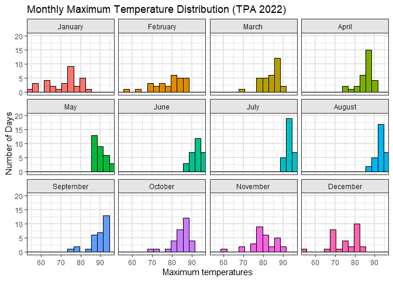

# Data Visualization Project 03

In this exercise you will explore methods to create different types of data visualizations (such as plotting text data, or exploring the distributions of continuous variables).

## PART 1: Density Plots

Using the dataset obtained from FSU's [Florida Climate Center](https://climatecenter.fsu.edu/climate-data-access-tools/downloadable-data), for a station at Tampa International Airport (TPA) for 2022, attempt to recreate the charts shown below which were generated using data from 2016. You can read the 2022 dataset using the code below:


``` r
library(tidyverse)
weather_tpa <- read_csv("https://raw.githubusercontent.com/aalhamadani/datasets/master/tpa_weather_2022.csv")
# random sample 
sample_n(weather_tpa, 4)
```

```
## # A tibble: 4 × 7
##    year month   day precipitation max_temp min_temp ave_temp
##   <dbl> <dbl> <dbl>         <dbl>    <dbl>    <dbl>    <dbl>
## 1  2022    12    27          0          68       40     54  
## 2  2022     7    23          1.69       94       77     85.5
## 3  2022     5     9          0          90       71     80.5
## 4  2022     8    20          0.47       96       79     87.5
```

See Slides from Week 4 of Visualizing Relationships and Models (slide 10) for a reminder on how to use this type of dataset with the `lubridate` package for dates and times (example included in the slides uses data from 2016).

Using the 2022 data:

(a) Create a plot like the one below:


```
## Warning: The `size` argument of `element_line()` is deprecated as of ggplot2 3.4.0.
## ℹ Please use the `linewidth` argument instead.
## This warning is displayed once every 8 hours.
## Call `lifecycle::last_lifecycle_warnings()` to see where this warning was
## generated.
```



Hint: the option `binwidth = 3` was used with the `geom_histogram()` function.

(b) Create a plot like the one below:


```
## Warning: Using `size` aesthetic for lines was deprecated in ggplot2 3.4.0.
## ℹ Please use `linewidth` instead.
## This warning is displayed once every 8 hours.
## Call `lifecycle::last_lifecycle_warnings()` to see where this warning was
## generated.
```


Hint: check the `kernel` parameter of the `geom_density()` function, and use `bw = 0.5`.

(c) Create a plot like the one below:


Hint: default options for `geom_density()` were used.

(d) Generate a plot like the chart below:


```
## Warning: package 'ggridges' was built under R version 4.4.3
```

```
## Warning: package 'viridis' was built under R version 4.4.3
```

```
## Loading required package: viridisLite
```

```
## Warning: package 'viridisLite' was built under R version 4.4.3
```

```
## Picking joint bandwidth of 1.93
```


```
## Picking joint bandwidth of 1.93
```

Hint: use the`{ggridges}` package, and the `geom_density_ridges()` function paying close attention to the `quantile_lines` and `quantiles` parameters. The plot above uses the `plasma` option (color scale) for the *viridis* palette.

(e) Create a plot of your choice that uses the attribute for precipitation *(values of -99.9 for temperature or -99.99 for precipitation represent missing data)*.


## PART 2


### Data on Concrete Strength

Concrete is the most important material in **civil engineering**. The concrete compressive strength is a highly nonlinear function of *age* and *ingredients*. The dataset used here is from the [UCI Machine Learning Repository](https://archive.ics.uci.edu/ml/index.php), and it contains 1030 observations with 9 different attributes 9 (8 quantitative input variables, and 1 quantitative output variable). A data dictionary is included below:

| Variable                      | Notes                 |
|-------------------------------|-----------------------|
| Cement                        | kg in a $m^3$ mixture |
| Blast Furnace Slag            | kg in a $m^3$ mixture |
| Fly Ash                       | kg in a $m^3$ mixture |
| Water                         | kg in a $m^3$ mixture |
| Superplasticizer              | kg in a $m^3$ mixture |
| Coarse Aggregate              | kg in a $m^3$ mixture |
| Fine Aggregate                | kg in a $m^3$ mixture |
| Age                           | in days               |
| Concrete compressive strength | MPa, megapascals      |

Below we read the `.csv` file using `readr::read_csv()` (the `readr` package is part of the `tidyverse`)


``` r
concrete <- read_csv("../data/concrete.csv", col_types = cols())
```

Let us create a new attribute for visualization purposes, `strength_range`:


``` r
new_concrete <- concrete %>%
  mutate(strength_range = cut(Concrete_compressive_strength, 
                              breaks = quantile(Concrete_compressive_strength, 
                                                probs = seq(0, 1, 0.2))) )
```

1.  Explore the distribution of 2 of the continuous variables available in the dataset. Do ranges make sense? Comment on your findings.


``` r
library(gridExtra)
```

```
## Warning: package 'gridExtra' was built under R version 4.4.3
```

```
## 
## Attaching package: 'gridExtra'
```

```
## The following object is masked from 'package:dplyr':
## 
##     combine
```

``` r
p1 <- new_concrete %>%
  ggplot(aes(x = Cement)) +
  geom_histogram(
    binwidth = 50,
    fill     = "#4C78A8",
    color    = "white"
  ) +
  labs(
    title = "Distribution of Cement Content",
    x     = "Cement (kg/m³)",
    y     = "Count"
  ) +
  theme_minimal(base_size = 14)

# 1b) Compressive strength density
p2 <- new_concrete %>%
  ggplot(aes(x = Concrete_compressive_strength)) +
  geom_density(
    fill  = "#F58518",
    alpha = 0.7,
    size  = 0.5
  ) +
  labs(
    title = "Density of Compressive Strength",
    x     = "Strength (MPa)",
    y     = "Density"
  ) +
  theme_minimal(base_size = 14)

# Arrange side by side
grid.arrange(p1, p2, ncol = 2)
```

<!-- -->

The histogram shows cement content clustering between 200–350 kg/m³, with only a few mixtures below 150 or above 450 kg/m³. The skew to the right indicated that in some more specialized cases denser concrete is used, however, the typical use case must lay with the 150-300 kg/m³ range. The strength density peaks around 30–40 MPa but stretches out toward 80 MPa, reflecting how higher cement content or longer curing boosts performance. It is interesting to note that more dense concrete doesn't necessarily mean stronger concrete.


2.  Use a *temporal* indicator such as the one available in the variable `Age` (measured in days). Generate a plot similar to the one shown below. Comment on your results.


The boxplot matches the reference in structure, using the same five strength‐range bins along the age axis and dropping any NA data points. The main differences are in styling. The palette differs slightly, however, both still use a rainbow them with the same sequence of colors. The size of some of the text may vary slightly but is consistent throughout both visualizations. The color-coded quintiles make it easy to see that the highest strength samples (purple) emerge predominantly between 28 and 91 days, while the lowest ranges (red and yellow) are confined to the first two weeks. Most strength gain happens in the first three months, with variability narrowing only slightly thereafter.


3.  Create a scatterplot similar to the one shown below. Pay special attention to which variables are being mapped to specific aesthetics of the plot. Comment on your results.


This data visualization is almost identical to the given one. The only two differences I can clearly distinguish is the legends are flipped. My visualization had the Age scale on the bottom while the given example has it on the top. The other noticeable difference is with the height of the graph. Bubble size shows that older samples tend to cluster at higher strengths, confirming the curing effect, while the color highlights that mid-range water levels often coincide with the strongest outcomes.
